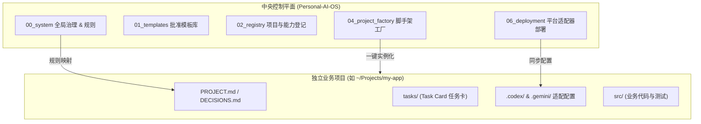

# Personal AI OS V1.1

> **系统状态**：`APPROVED_FOR_RELEASE` | **版本**：`v1.1.0` | **批准凭证**：`PAOS-REL-001`
> 
> 本仓库是 **Personal AI OS** 的 **Canonical Control Plane（本地中央控制平面）**，用于统筹和治理跨设备、多 Agent（Codex & Gemini）的个人 AI 研发工作流与独立业务项目。

---

## 🎯 系统定位与核心价值

**Personal AI OS 解决了什么问题？**
* **消除 Agent 幻觉与上下文冗余**：通过“最小充分上下文”与结构化路由（[AGENTS.md](file:///Users/lotop/Personal-AI-OS/AGENTS.md)），避免无差别全量加载规则和历史。
* **业务项目绝对隔离**：所有具体业务工程（Web应用、CLI工具、数据管道等）均由脚手架实例化为独立外部仓库，不在控制平面内堆砌业务代码。
* **双 Agent（Codex + Gemini）高效协同**：统一定义平台适配器，Gemini 负责架构规划与审查，Codex 负责精准单测与代码实现。
* **任务卡与决策防漂移**：以 Task Card（任务卡）为最小交付单元，所有技术决策沉淀于 `DECISIONS.md`，对话记录不作为事实源头。

---

## 🏗️ 核心架构与工作流



---

## 🚀 3 分钟快速上手

### 1. 环境准备与系统自检
* **推荐环境**：Python 3.11+（或 Python 3.9/3.10 并安装 `pip install tomli`）。
* **运行离线全量门禁检查**：
  ```bash
  python3 05_harness/ci_gate.py --profile local-offline
  ```
  *确保 M1–M6 所有验证项显示 `PASS`。*

### 2. 部署 Codex 与 Gemini 适配器
在当前仓库根目录下执行同步部署：
```bash
# 部署 Codex 适配配置 (.codex/config.toml)
python3 06_deployment/deploy_adapter.py --manifest 03_adapters/codex/manifest.toml --target . --apply

# 部署 Gemini 适配配置 (.gemini/settings.json)
python3 06_deployment/deploy_adapter.py --manifest 03_adapters/gemini-cli/manifest.toml --target . --apply
```

### 3. 创建你的第一个独立业务项目
你可以通过以下任一方式一键创建独立项目：

* **方式 A：在聊天窗口呼叫 Skill（最简便）**
  > `@create-paos-project 帮我创建一个名为 my-tool 的软件项目，增加 ai 和 software 扩展包`

* **方式 B：通过命令行运行脚手架**
  ```bash
  python3 04_project_factory/create_project.py \
    --template-pack 01_templates/project-base-pack \
    --target /Users/lotop/Projects/my-tool \
    --project-id my-tool \
    --name "My Tool" \
    --owner lotop \
    --primary-type SOFTWARE_PRODUCT \
    --overlay software --overlay ai \
    --git \
    --apply
  ```
  创建后直接进入新项目：`cd /Users/lotop/Projects/my-tool` 即可开始开发。

---

## 💡 双 Agent 协同最佳实践

| 角色 | 推荐 Agent | 核心职责 |
| :--- | :--- | :--- |
| **总控与架构师** | **Gemini / Antigravity** | 制定项目目标（`PROJECT.md`）、拆解具体任务卡（`tasks/TASK-xxx.md`）、把控只读/只改文件范围（Read/Write Set）、代码审查与架构决策（`DECISIONS.md`）。 |
| **工程师与执行者** | **Codex** | 严格围绕单张 Task Card 进行代码编写、单测实现（TDD）与局部重构，确保小步交付。 |

---

## 📂 仓库目录导航

```text
Personal-AI-OS/
├── AGENTS.md               # Agent 统一启动与规则路由器
├── PROJECT.md              # 本控制平面的目标与范围
├── DECISIONS.md            # 系统级架构决策记录
├── SYSTEM.toml             # 机器可读的元数据描述
│
├── 00_system/              # 【核心规则源】治理、安全、Mode、Memory 与多 Agent 同步
├── 01_templates/           # 【模板库】经过严格审批的基础项目包（project-base-pack 等）
├── 02_registry/            # 【注册表】Projects、Agents、Skills 与 Hooks 状态登记
├── 03_adapters/            # 【适配层】Codex 与 Gemini 原生配置生成源
├── 04_project_factory/     # 【项目工厂】独立业务项目创建引擎与验证
├── 05_harness/             # 【验证机制】CI 门禁检查、离线自检与验收工具
├── 06_deployment/          # 【部署工具】适配器原子部署、备份与恢复脚本
├── 07_working/             # 【临时工作区】草案、候选方案与评审材料
├── 08_history/             # 【历史证据】发布证据与历史基线
├── 09_archive/             # 【归档】已替代但需留存追溯的材料
└── 99_temp/                # 【临时存储】缓存、日志与测试生成物（不受版本控制）
```

---

## 🔒 核心治理原则

1. **单向生成**：`00_system/` 是规则的唯一事实来源；`.codex`、`.gemini` 等平台配置由适配器生成，严禁手动逆向修改。
2. **零静默覆盖**：所有文件写入均支持 Dry Run 预检与带备份的原子替换。
3. **Hooks 审慎开启**：Phase 1 阶段自动化 Hook 默认关闭，避免未经授权的自动化操作。

