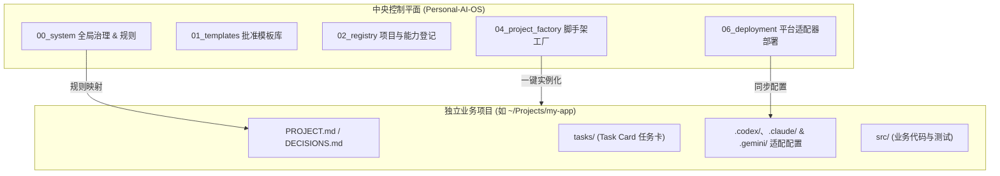

# Personal AI OS V1.2.1 Approved Local Release

> **当前状态**：`APPROVED` | **当前发布**：`v1.2.1` | **已批准基线**：`v1.2.1`（`PAOS-REL-007`）
> 
> 本仓库是 **Personal AI OS** 的 **Canonical Control Plane（本地中央控制平面）**，用于统筹和治理跨设备、多 Agent（Codex、Claude Code 与 Antigravity）的个人 AI 研发工作流与独立业务项目。

---

## 💡 设计哲学 (Design Philosophy)

Personal AI OS 的诞生源于对 LLM Agent 辅助开发中常见痛点（如上下文幻觉、规则漂移、代码随意覆盖、知识随对话关闭而丢失）的工程反思：

1. **本地优先与主权控制 (Local-First & Sovereign Control)**
   * 所有规则、决策、模板与配置均以本地 Git 仓库作为唯一事实来源（Source of Truth），不依赖任何单一云端厂商的私有上下文绑定，确保个人资产可长期迁移、追溯与离线复原。
2. **最小充分上下文 (Minimal Sufficient Context)**
   * 坚决反对“将所有规则一股脑塞入 Prompt”。通过分层路由机制，仅在 Agent 执行特定任务时按需加载：`适用的安全规则 → 当前 Mode → 项目 PROJECT.md → 当前 Task Card → 指定代码`，最大程度减少 Token 消耗并降低模型幻觉。
3. **确定性护栏与流动式智能 (Deterministic Guardrails & Fluid Intelligence)**
   * Agent 模型本身是具备概率性和流动性的“执行者”，而系统规则、状态机校验、权限边界与适配器生成则是“确定性的”。通过严格的 Schema、TOML 校验与 CI 门禁，为 Agent 施加确定性的安全防线。
4. **会话是痕迹，文档是事实 (Conversation is Trace, Document is Truth)**
   * 临时对话记录会丢失、截断和被遗忘，绝不能作为系统的核心事实源。任何架构决策必须沉淀入 `DECISIONS.md`，任何交付物必须绑定可复现的 Git Commit 与测试验证。
5. **默认安全与零静默覆盖 (Safe-by-Default & Zero Silent Overwrite)**
   * 所有写入操作默认先执行 Dry Run 演练并展示 Diff；文件替换强制实行原子暂存与自动备份，杜绝静默破坏性覆盖。

---

## 🏗️ 核心架构与设计原理



### 1. 控制平面与执行平面解耦 (Control Plane vs Execution Plane)
* **控制平面（Control Plane）**：即本仓库，专注于元规则（Meta-rules）、模板包、注册表及跨 Agent 适配器的生成，严禁在此堆砌具体的业务应用源码。
* **执行平面（Execution Plane）**：具体的业务项目以独立仓库形式存在于外部目录，仅保留轻量级项目级路由（`AGENTS.md`）和配置（`.codex/`、`.gemini/`），保持干净与专注。

### 2. 单向生成机制 (Unidirectional Adapter Synthesis)
人工维护结构化的标准配置与 Markdown 规则，经由生成器（`05_harness/generate_adapters.py`）单向编译输出到各个 Agent 平台的原生格式（如 `.codex/config.toml`、`CLAUDE.md`、`.claude/settings.json` 与 `.gemini/settings.json`）。禁止反向手改平台配置，避免产生配置漂移。

### 3. 任务卡驱动的状态机 (Task-Card Driven State Machine)
任务以 Task Card（任务卡）为最小交付单元，使用一个主状态和独立验证证据：
```
TODO ──> ACTIVE ──> REVIEW ──> DONE
           │
           └──> BLOCKED
```
`validation` 记录验证证据，不再作为并行状态轴。每张任务卡显式约束 `Read Set`（只读范围）与 `Write Set`（只改范围），降低多任务、多 Agent 协作时的写冲突与意外越界。

---

## 🎯 适用场景 (Applicable Scenarios)

* 🚀 **全栈软件产品研发**：从脚手架初始化、模块设计、单测驱动（TDD）到复杂重构，保持代码风格与架构规范高度统一。
* 💡 **产品探索与商业分析**：支持商业模式画布（BMC）、精益画布（Lean Canvas）、PRD 需求规格与竞品分析的标准化撰写与迭代。
* 🔬 **深度研究与架构决策 (ADR)**：在面临复杂技术选型、数据库/框架重构时，通过严格的 `DECISIONS.md` 记录决策依据、替代方案与潜在风险。
* 🤖 **跨 Agent 协同研发**：通过统一 Canonical Rule 协调 Codex、Claude Code 与 Antigravity CLI；各平台能力与验证状态分别登记，不把 Config Load 等同于 Live Runtime。
* 📚 **个人数字资产与知识积累**：跨年度、跨项目沉淀经过验证的最佳实践模板与技能包，告别项目碎片化。

---

## 🛠️ 技术规格与实现说明 (Technical Specifications)

### 1. 数据格式与分层规范
| 格式 | 用途 | 适用场景 |
| :--- | :--- | :--- |
| **Markdown (`.md`)** | 人类与 Agent 共同阅读的非结构化知识 | 治理规范、架构决策（`DECISIONS.md`）、项目目标（`PROJECT.md`）、任务卡（`TASK-*.md`） |
| **TOML (`.toml`)** | 人工维护的 Canonical 结构化配置 | 系统元数据（`SYSTEM.toml`）、注册表（`02_registry/`）、工厂配置（`factory.toml`） |
| **JSON (`.json`)** | 平台原生配置文件与机器生成数据 | Agent 平台配置（`.claude/settings.json`、`.gemini/settings.json`）、脚手架初始化元数据（`.paos-init.json`） |
| **JSONL (`.jsonl`)** | 追加式审计与事件日志 | 运行时事件流、会话转录与审计跟踪记录 |

### 2. 运行环境与零外部依赖设计
* **纯标准库驱动**：核心工具链（`create_project.py`、`deploy_adapter.py`、`ci_gate.py` 等）全面适配 Python 3.11+ 标准库 `tomllib`（或 Python 3.9/3.10 + 轻量 `tomli`），无需安装任何庞大的第三方框架，秒级冷启动。
* **原生 Git 绑定**：深度集成 Git 工作流，支持分支隔离、Worktree 独立工作区以及 SHA-256 文件指纹校验。

---

## 🚀 3 分钟快速上手

### 1. 环境准备与系统自检
```bash
# 运行本地离线检查；它不等同于 Release Readiness
python3 05_harness/ci_gate.py --profile local-offline

# 检查 M1–M6 门禁
python3 05_harness/ci_gate.py --profile release-readiness
```

### 2. 部署 Codex、Claude Code 与 Antigravity 适配器
在当前仓库根目录下执行同步部署：
```bash
# 部署 Codex 适配配置 (.codex/config.toml)
python3 06_deployment/deploy_adapter.py --manifest 03_adapters/codex/manifest.toml --target . --scope PROJECT --authorization-ref PAOS-DEPLOY-001 --record-dir 99_temp/deploy_records --apply

# 部署 Claude Code 适配配置 (CLAUDE.md 与 .claude/settings.json)
python3 06_deployment/deploy_adapter.py --manifest 03_adapters/claude-code/manifest.toml --target . --scope PROJECT --authorization-ref PAOS-DEPLOY-001 --record-dir 99_temp/deploy_records --apply

# 部署 Antigravity 适配配置 (.gemini/settings.json)
python3 06_deployment/deploy_adapter.py --manifest 03_adapters/antigravity-cli/manifest.toml --target . --scope PROJECT --authorization-ref PAOS-DEPLOY-001 --record-dir 99_temp/deploy_records --apply
```

### 3. 创建你的第一个独立业务项目
* **方式 A：在聊天窗口呼叫 Skill（推荐）**
  > `@create-paos-project 帮我创建一个名为 my-tool 的软件项目，打上 ai 和 software 分类标签`

* **方式 B：通过命令行运行脚手架**
  ```bash
  python3 04_project_factory/create_project.py \
    --template-pack 01_templates/project-base-pack \
    --target /Users/lotop/Projects/my-tool \
    --project-id my-tool \
    --name "My Tool" \
    --owner lotop \
    --primary-type SOFTWARE_PRODUCT \
    --overlay software --overlay ai \
    --git \
    --apply
  ```
  创建后直接进入新项目：`cd /Users/lotop/Projects/my-tool` 即可开始开发。

  > **关于 `--overlay`**：当前版本的 overlay 是**项目分类标签**，只做取值校验并记录到 `project.toml` 的 `overlays_csv` 与 `.paos-init.json`，不会改变生成的文件内容。差异化模板内容属于后续 Template Pack 工作，尚未实现。

---

## 💡 多 Agent 协同最佳实践

| 角色 | 推荐 Agent | 核心职责 |
| :--- | :--- | :--- |
| **总控与架构师** | **Antigravity (AGY)** | 制定项目目标（`PROJECT.md`）、拆解具体任务卡（`tasks/TASK-xxx.md`）、把控只读/只改文件范围（Read/Write Set）、代码审查与架构决策（`DECISIONS.md`）。 |
| **研究与审查协作者** | **Claude Code** | 通过 `CLAUDE.md` 导入同一 `AGENTS.md` Router，在相同 Task Card、权限和 Source-of-Truth 边界下进行实现、分析或审查。 |
| **工程师与执行者** | **Codex** | 严格围绕单张 Task Card 进行代码编写、单测实现（TDD）与局部重构，确保小步交付。 |

---

## 📂 仓库目录导航

```text
Personal-AI-OS/
├── AGENTS.md               # Agent 统一启动与规则路由器
├── CLAUDE.md               # Claude Code 原生入口，导入 AGENTS.md
├── PROJECT.md              # 本控制平面的目标与范围
├── DECISIONS.md            # 系统级架构决策记录
├── SYSTEM.toml             # 机器可读的元数据描述
│
├── 00_system/              # 【核心规则源】治理、安全、Mode、Memory 与多 Agent 同步
├── 01_templates/           # 【模板库】经过严格审批的基础项目包（project-base-pack 等）
├── 02_registry/            # 【注册表】Projects、Agents、Skills 与 Hooks 状态登记
├── 03_adapters/            # 【适配层】Codex、Claude Code 与 Antigravity 原生配置生成物
├── 04_project_factory/     # 【项目工厂】独立业务项目创建引擎与验证
├── 05_harness/             # 【验证机制】CI 门禁检查、离线自检与验收工具
├── 06_deployment/          # 【部署工具】适配器原子部署、备份与恢复脚本
├── 07_working/             # 【临时工作区】草案、候选方案与评审材料
├── 08_history/             # 【历史证据】发布证据与历史基线
├── 09_archive/             # 【归档】已替代但需留存追溯的材料
└── 99_temp/                # 【临时存储】缓存、日志与测试生成物（不受版本控制）
```

---

## 🔒 核心治理原则

1. **单向生成**：`00_system/` 是规则的唯一事实来源；`.codex`、`.claude`、`.gemini` 等平台配置由适配器生成，严禁手动逆向修改。
2. **零静默覆盖**：所有文件写入均支持 Dry Run 预检与带备份的原子替换。
3. **Hooks 审慎开启**：Phase 1 阶段自动化 Hook 默认关闭，避免未经授权的自动化操作。

